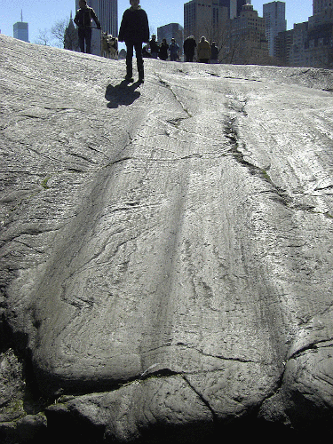
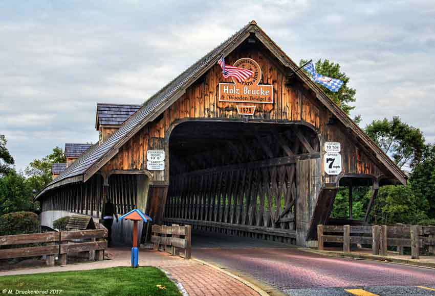

## **Day 2 | Notre Dame | 20 years ago**
 
 
 Clarke Memorial Fountain
 https://en.wikipedia.org/wiki/Clarke_Memorial_Fountain
 
  
 Grotto of Our Lady of Lourdes
 https://tour.nd.edu/locations/grotto-of-our-lady-of-lourdes/
 https://en.wikipedia.org/wiki/Grotto_of_Our_Lady_of_Lourdes,_Notre_Dame

## **Day 3 | St Patrick’s Cathedral**

 

## **Day 3 | Central Park | Umpire Rock/Rat Rock**

  
### 10 years ago – src: http://hudsonvalleygeologist.blogspot.com/2011/03/umpire-rat-rock-in-central-park.html

### Q29C+PRJ New York
 
## **Day 4 | Statue of Liberty**
 
  
  
  
 
Corrosive Seep – 2002.  https://www.flickr.com/photos/hink/78790746/in/photolist-2iJc3CE-BNR37B-ARjL4U-53LjhJ-2LnpAd-7XPLk-7XPK9-7XPKy-7XPJR-yQF7Z
 
## **Day 5| Plymouth Rock**

 
 
 
## **Day 6 | Nubble Lighthouse**
 
  
 
## **Day 7 | Old Brick Store | 2009**

  
 
## **Day 8 | Rock of Ages Quarry**

 
 
https://www.atlasobscura.com/places/rock-of-ages-granite-quarry
https://www.hmdb.org/PhotoFullSize.asp?PhotoID=301968
https://www.hmdb.org/m.asp?m=81271

 
## **Day 9 | Quechee Gorge**

 
 
## **Day 10 | Niagara Falls**
 
  
  
  
## **Day 11 | Frankenmuth – Holz Brucke bridge**

### 2017
 
 
